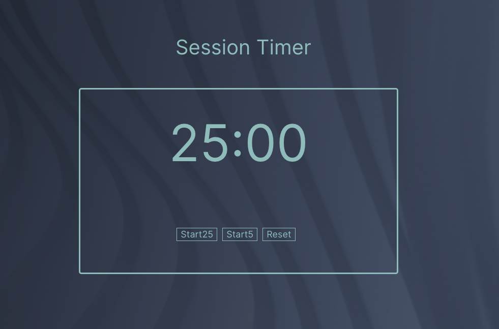
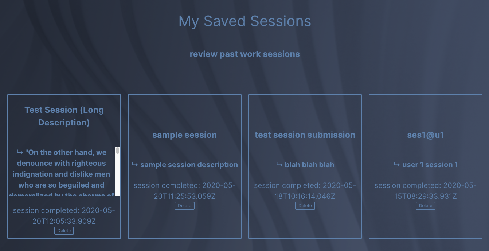
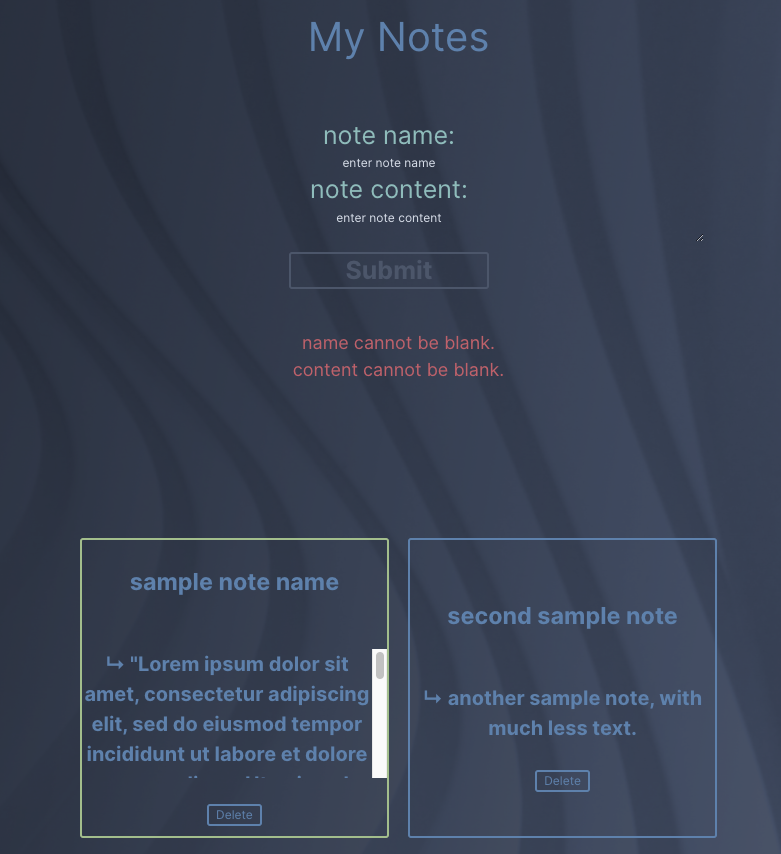

# Pomodoro App

This is a pomodoro timer app that optionally allows users to save unique pomodoro session information and notes
for reference during work.

## Set up

set up the server, from `https://github.com/meta-434/capstone-one-server`

1. Clone this repository to your local machine `git clone https://github.com/meta-434/capstone-one-client.git`
2. `cd` into the cloned repository
4. Install the node dependencies `npm install`
5. Edit the `.env` that will be ignored by git with `REACT_APP_SERVER_URL` equal to the address of the server

## Scripts

Start the application `npm start`

Start nodemon for the application `npm run dev`

Run the tests `npm test`

# Notes

to use a pre-made account without needing to sign up, use 

username: `test-user`
 
password: `test-password`

if nothing appears to happen when trying to use the app, wait 30-45 seconds for the hosted database to spin up.

# Tech

+ React
 
+ React-Router-Dom
 
+ Context API

# Screenshots

timer: 

sessions display: 

notes display: 
